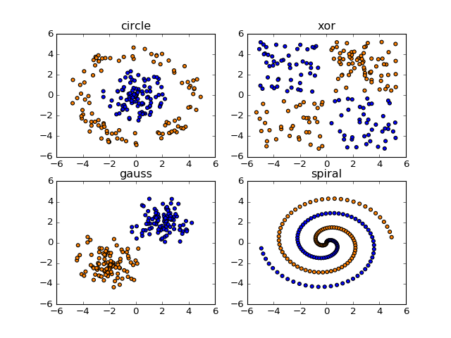

# Theano, TensorFlow, Keras

Andrea Suckro, Alexander Höreth, \today

**Concepts and Applications of Neural Networks**, University of Osnabrück

High level abstractions for efficient low level computations.

## Similarities

  * Process:
    1. Transcribe code into a computation graph
    2. Optimize the graph
    3. Outsource computations as a whole to (preferably) the GPU

## Differences

  * Different levels of abstractions:
    * Keras is very abstract, better for prototyping
    * Theano/Tensorflow is rather low level, more general purpose
  * Tensorflow: Provides very expressive visualization tools

## Hands-on Examples
Checkout our CANN repository which offers you a stepping stone to actually apply the presented frameworks. Specifically the `/playground` folder gives you the opportunity to combine intuition earned from `playground.tensorflow.org` with implementation in different frameworks. Play with this before going all in with one of the frameworks for your next project!

`github.com/AndreaSuckro/CANN`

{height=30%}
